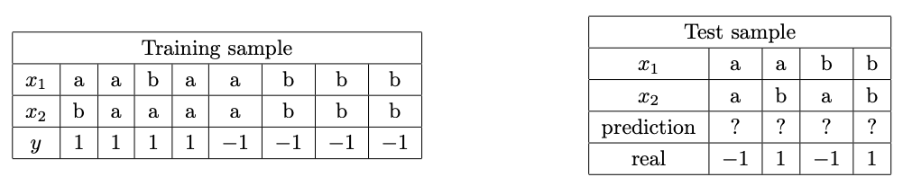
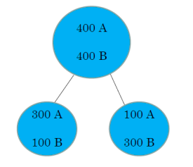
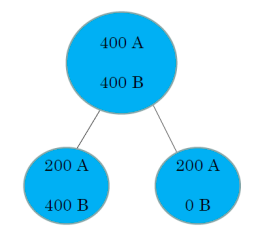
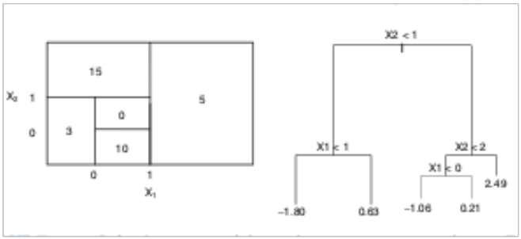
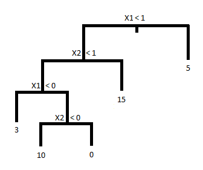
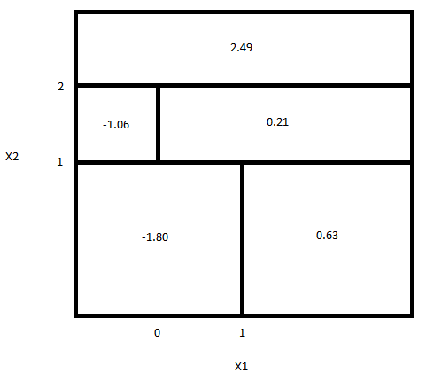

```{r setup, include=FALSE}
knitr::opts_chunk$set(echo = TRUE)
```
# Práctico 2
## Ejercicio 1
From the Bayes Classifier, predict the class for each test data and compute the error.
```{r ej3-1, echo=FALSE, fig.cap=NULL, out.width = '100%'}

```

**Solución:**

```{r ej3-src, echo=TRUE}
# generamos los datos de entrenamiento
x1=c('a','a','b','a','a','b','b','b')
x2=c('b','a','a','a','a','b','b','b')
y=c(1,1,1,1,-1,-1,-1,-1)

train = t(rbind(x1,x2,y=as.numeric(y))); train


# generamos los datos de prueba (con la predicción inicializada en 0)
x1=c('a','a','b','b')
x2=c('a','b','a','b')
pred=c(0,0,0,0)
real=c(-1,1,-1,1)

test=t(rbind(x1,x2,pred,real)); test

# función para calcular las probabilidades a priori 
prior = function(y){ sum(train[,3] == y)/dim(train)[1] }

# función para calcular la densidad condicionada de X dado Y 
g = function(x1,x2,y) { 
  sum(colSums(t(train) == c(x1, x2, y)) == 3) / sum(train[,3] == y)
}

# clasificador
classifyValue = function(v) { 
  ifelse(prior(1)*g(v[1],v[2],1) > prior(-1)*g(v[1],v[2],-1), 1, -1) 
}

# aplicamos el clasificador a los datos de prueba
test[,3] = apply(test,1,classifyValue); test

#computamos el error
error = sum(test[,3] != test[,4]) / dim(test)[1]; error
```

## Ejercicio 3
Generate 100 observations from a bivariate Gaussian distribution $N(\mu_1, \Sigma_1)$ with $\mu_1=(3, 1)'$ and $\Sigma_1=I$ (identity matrix) and label them as 1. Generate another 100 observations from a bivariate Gaussian distribution $N(\mu_2, \Sigma_2)$ with $\mu_2 = (1, 3)'$ and $\Sigma_2 = I$ and label them as 0.

a) Write an R code to generate this data set.
b) Plot this data using different colors for the two classes.
c) Assuming that priors are equals, derive the Bayes Classifier.
d) Compute the training error.
e) Train a linear regression model, using the function lm(y x), with the training set.
f) Plot the boundary decision of Bayes Classifier and the line obtained by the linear regression model.
g) Generate a test set and compute the test error of Bayes Classifier and the linear model.
$\newline$

**Solución:**
$\newline$
a)
```{r 3-a}
set.seed(2019)
library(mvtnorm)

# generamos el set de datos
xx_1=rmvnorm(100,mean=c(3,1),sigma=matrix(c(1,0,0,1),2,2)); xx_1=cbind(xx_1,1)
xx_0=rmvnorm(100,mean=c(1,3),sigma=matrix(c(1,0,0,1),2,2)); xx_0=cbind(xx_0,0)

xx=rbind(xx_1,xx_0)
```
\newpage
$\newline$
b)
```{r 3-b}
# rangos para los ejes de la gráfica
xrange=c(min(floor(min(xx_1[,1])),floor(min(xx_0[,1]))),
         max(ceiling(max(xx_1[,1])),ceiling(max(xx_0[,1]))))
yrange=c(min(floor(min(xx_1[,2])),floor(min(xx_0[,2]))),
         max(ceiling(max(xx_1[,2])),ceiling(max(xx_0[,2]))))

# graficamos los datos con distintos colores para cada clase
# plot(xx_1,xlim=xrange,ylim=yrange,xlab="x1",ylab="x2",main="Data Set")
plot(xx_1,xlim=c(-2,6),ylim=c(-2.5,6.8),xlab="x1",ylab="x2",main="Data Set")
points(xx_1,pch=19,col="red")
points(xx_0,pch=19,col="blue")

legend("topleft", 
       legend=c("Clase 1","Clase 0"), 
       pch=c(19,19), col=c("red","blue"), bg="white")
```
$\newline$
$\newline$
c) Como las probabilidades a priori son iguales, el clasificador va a ser: 

$$F^*(x,y)=\left\{\begin{matrix}
1 & \text{si } g_1(x,y)>g_0(x,y) \\ 
0 & \text{si } g_1(x,y)<g_0(x,y)
\end{matrix}\right.$$

siendo $g_i$ la función de densidad condicionada de $X$ dado $Y=i$. En este caso es la función de densidad de una normal bivariada para los $\mu$ y $\Sigma$ respectivos:

$$g_1(x,y)=\frac{1}{2 \pi} e^{-\frac{1}{2} \left(\begin{array}{cc} x-3 & y-1\end{array}\right) \left(\begin{array}{cc} 1 & 0 \\ 0 & 1 \end{array}\right) \left(\begin{array}{c} x-3 \\ y-1 \end{array}\right)}=\frac{1}{2 \pi} e^{-\frac{1}{2} ((x-3)^2+(y-1)^2)}$$

$$g_0(x,y)=\frac{1}{2 \pi} e^{-\frac{1}{2} \left(\begin{array}{cc} x-1 & y-3\end{array}\right) \left(\begin{array}{cc} 1 & 0 \\ 0 & 1 \end{array}\right) \left(\begin{array}{c} x-1 \\ y-3 \end{array}\right)}=\frac{1}{2 \pi} e^{-\frac{1}{2} ((x-1)^2+(y-3)^2)}$$
$\newline$

Operando $g_1(x)>g_0(x)$ queda:
$\newline$

$$\frac{1}{2 \pi} e^{-\frac{1}{2} ((x-3)^2+(y-1)^2)} > \frac{1}{2 \pi} e^{-\frac{1}{2} ((x-1)^2+(y-3)^2)}$$

$$(x-3)^2+(y-1)^2 < (x-1)^2+(y-3)^2$$

$$x^2-6x+9+y^2-2y+1 < x^2-2x+1+y^2-6y+9$$

$$-6x-2y < -2x-6y$$

$$4y < 4x$$

$$y < x$$
$\newline$

Es decir que el clasificador en definitiva queda:

$$F^*(x,y)=\left\{\begin{matrix}
1 & \text{si } x>y \\ 
0 & \text{si } x<y
\end{matrix}\right.$$
$\newline$
$\newline$
$\newline$
d)
```{r 3-d}
# computamos el error de entrenamiento
xtrain=xx[,1:2]
ytrain=xx[,3]

error_train=sum((xtrain[,2]<xtrain[,1])!=ytrain)/dim(xtrain)[1]; error_train
```
$\newline$
e)
```{r 3-e}
# entrenamos un modelo de regresión lineal a partir de los datos de prueba
model=lm(ytrain~xtrain)
```
$\newline$
f)
```{r 3-f}
plot(xx_1,xlim=c(-3,6),ylim=c(-2.5,7),xlab="x1",ylab="x2",main="Data Set + Boundaries")
points(xx_1,pch=19,col="red")
points(xx_0,pch=19,col="blue")

# determinamos el coeficiente y el intercepto de la frontera del clasificador lineal
a=(0.5-model$coef[1])/model$coef[3]
b=-model$coef[2]/model$coef[3]

# graficamos la frontera del clasificador lineal
abline(a=a,b=b,lwd=2,col="green")
# graficamos la frontera del clasificador de Bayes
abline(c(0,1),lwd=2,col="orange")

legend("topleft", 
       legend=c("Clase 1","Clase 0","Linear Model", "Bayes Model"), 
       pch=c(19,19,NA,NA),col=c("red","blue","green","orange"),bg="white",lwd=c(NA,NA,2,2))
```
$\newline$
$\newline$
$\newline$
$\newline$
$\newline$
g)
```{r 3-g, warning=FALSE}
# genero datos de prueba
xx_1=rmvnorm(25,mean=c(3,1),sigma=matrix(c(1,0,0,1),2,2)); xx_1=cbind(xx_1,1)
xx_0=rmvnorm(25,mean=c(1,3),sigma=matrix(c(1,0,0,1),2,2)); xx_0=cbind(xx_0,0)
xx=rbind(xx_1,xx_0)
xtest=xx[,1:2]
ytest=xx[,3]

# predecimos las etiquetas de los datos de prueba con el modelo lineal
pred=function(x){model$coef[1]+x[1]*model$coef[2]+x[2]*model$coef[3] > 0.5}
data_pred=apply(xtest,1,pred)

# computamos el error del modelo lineal
lm_error=mean(data_pred!=ytest); lm_error
# computamos el error del clasificador de Bayes
bayes_error=sum((xtest[,2]<xtest[,1])!=ytest)/dim(xtest)[1]; bayes_error
```
\newpage

# Práctico 3
## Ejercicio 3

Compute $\Delta i(t, s)$ for these two partitions using classification error, Gini index and entropy


```{r partition_1, echo=FALSE, fig.cap=NULL, out.width = '100%'}


```
\newline

**Solución:**

El $\Delta i(t, s)$ se calcula como: $\Delta i(t, s) = i(t) - p_L*i(t_L) - p_R*i(t_R)$ 

siendo:

- $i(t)$ la impureza del nodo $t$
- $i(t_L)$ la impureza del nodo hijo izquierdo $t_L$
- $i(t_R)$ la impureza del nodo hijo derecho $t_R$
- $p_L$ la proporción de datos en el nodo hijo izquierdo
- $p_R$ la proporción de datos en el nodo hijo derecho
 \newline
 \newline
 
 **Partición 1**

- $p_L=400/800=0.5$
- $p_R=400/800=0.5$
- $p_A(t)=400/800=0.5$
- $p_B(t)=400/800=0.5$
- $p_A(t_L)=300/400=0.75$
- $p_B(t_L)=100/400=0.25$
- $p_A(t_R)=100/400=0.25$
- $p_A(t_R)=300/400=0.75$

$\newline$

Classification Error:

- $i(t)=1-\max\{p_A(t),p_B(t)\}=0.5$
- $i(t_L)=1-\max\{p_A(t_L),p_B(t_L)\}=0.25$
- $i(t_R)=1-\max\{p_A(t_R),p_B(t_R)\}=0.25$

**Sol**: $\Delta i(t, s) = 0.5 - 0.5*0.25 - 0.5*0.25 = 0.25$
\newline

Gini Index:

- $i(t)=1-(p_A(t)^2+p_B(t)^2)=0.5$
- $i(t_L)=1-(p_A(t_L)^2+p_B(t_L)^2)=0.375$
- $i(t_R)=1-(p_A(t_R)^2+p_B(t_R)^2)=0.375$

**Sol**: $\Delta i(t, s) = 0.5 - 0.5*0.375 - 0.5*0.375 = 0.125$
\newline

Entropy:

- $i(t)=-(p_A(t)*\log(p_A(t))+p_B(t)*\log(p_B(t)))=1$
- $i(t_L)=-(p_A(t_L)*\log(p_A(t_L))+p_B(t_L)*\log(p_B(t_L)))=0.81$
- $i(t_R)=-(p_A(t_R)*\log(p_A(t_R))+p_B(t_R)*\log(p_B(t_R)))=0.81$

**Sol**: $\Delta i(t, s) = 1 - 0.5*0.81 - 0.5*0.81 = 0.19$
\newline
 
 **Partición 2**

- $p_L=600/800=0.75$
- $p_R=200/800=0.25$
- $p_A(t)=400/800=0.5$
- $p_B(t)=400/800=0.5$
- $p_A(t_L)=200/600=0.33$
- $p_B(t_L)=400/600=0.67$
- $p_A(t_R)=200/200=1$
- $p_A(t_R)=0/200=0$
\newline

Classification Error:

- $i(t)=1-\max\{p_A(t),p_B(t)\}=0.5$
- $i(t_L)=1-\max\{p_A(t_L),p_B(t_L)\}=0.33$
- $i(t_R)=1-\max\{p_A(t_R),p_B(t_R)\}=0$

**Sol**: $\Delta i(t, s) = 0.5 - 0.75*0.33 - 0.25*0 = 0.25$
\newline

Gini Index:

- $i(t)=1-(p_A(t)^2+p_B(t)^2)=0.5$
- $i(t_L)=1-(p_A(t_L)^2+p_B(t_L)^2)=0.44$
- $i(t_R)=1-(p_A(t_R)^2+p_B(t_R)^2)=0$

**Sol**: $\Delta i(t, s) = 0.5 - 0.75*0.44 - 0.25*0 = 0.17$
\newline

Entropy:

- $i(t)=-(p_A(t)*\log(p_A(t))+p_B(t)*\log(p_B(t)))=1$
- $i(t_L)=-(p_A(t_L)*\log(p_A(t_L))+p_B(t_L)*\log(p_B(t_L)))=0.92$
- $i(t_R)=-(p_A(t_R)*\log(p_A(t_R))+p_B(t_R)*\log(p_B(t_R)))=0$

**Sol**: $\Delta i(t, s) = 1 - 0.75*0.92 - 0.25*0 = 0.31$

\newpage
## Ejercicio 4

Let's consider the following figure:

```{r pressure, echo=FALSE, fig.cap=NULL, out.width = '100%'}

```

a) Sketch the tree corresponding to the partition of the predictor space illustrated in the left-hand panel
of the figure.
b) Create a diagram similar to the left-hand panel of the figure, using the tree illustrated in the righthand panel of the same figure.

**Solución:**

a)<p>
```{r 4-a, echo=FALSE, fig.cap=NULL, fig.align='center'}

```
</p>

b)<p>
```{r 4-b, echo=FALSE, fig.cap=NULL, fig.align='center'}

```
</p>